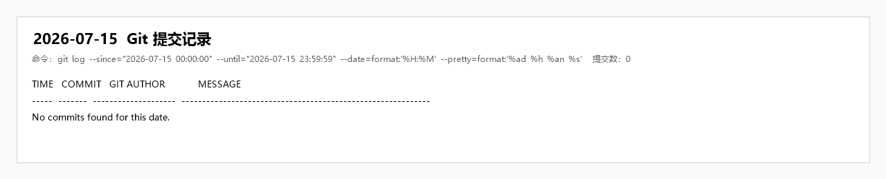

# 企业智慧招聘 OA 软件项目开发日志

## 一、基本信息

| 项目 | 内容 |
| --- | --- |
| 日期 | 2026 年 7 月 15 日 |
| 开发日 | Day 1（第一日） |
| 所属阶段 | 阶段一：启动与设计 |
| 当日主题 | 环境搭建、数据库设计、前后端项目初始化 |
| 里程碑 | M1：开发环境就绪 |

## 二、当日目标

根据《企业智慧招聘 OA 软件项目开发计划》，第一日需完成项目启动与基础设计工作，为后续登录认证、职位管理、简历管理及 AI 能力开发建立统一基础。

当日主要目标如下：

1. 明确项目技术架构、模块边界和团队分工。
2. 完成后端 Spring Boot 多模块工程的基础搭建与依赖配置。
3. 完成 Vue 3 前端工程初始化、基础依赖安装、路由和 Layout 布局搭建。
4. 完成用户、职位、简历、投递、面试五类核心业务表的初步设计。
5. 准备 MySQL、Redis Stack、Elasticsearch 等本地开发环境并验证基础连通性。
6. 建立测试计划、测试用例和缺陷跟踪的基本规范。

## 三、人员分工与完成情况

| 负责人 | 角色 | 当日计划 | 完成情况 |
| --- | --- | --- | --- |
| 牛泽政 | 项目组长 / 项目经理 | 数据库设计、Spring Boot 项目创建、依赖及配置文件设置 | 完成总体架构确认；建立后端多模块结构；完成核心业务表及关联关系设计；整理基础配置项 |
| 张宇阳 | 后端开发工程师 | 安装并验证 Elasticsearch、Redis、MySQL，执行建表 SQL | 完成本地中间件环境准备；整理数据库初始化脚本；验证数据库、缓存及搜索服务的基础访问方式 |
| 刘政 | 前端开发工程师 | 创建 Vue 3 项目，安装前端依赖，配置路由和 Layout | 完成 Vite + Vue 3 工程初始化；接入 Element Plus、Axios、Vue Router 和 Pinia；建立页面目录、路由与公共布局骨架 |
| 唐明轩 | 测试 / 文档负责人 | 编写测试计划、测试用例模板和 Bug 跟踪表 | 完成测试范围梳理；建立功能测试用例和缺陷记录字段；整理首日环境检查项与项目文档目录 |

## 四、开发工作记录

### 4.1 项目架构与模块规划

- 确定系统采用前后端分离架构，前端通过 `/api` 访问核心招聘服务。
- 后端划分为核心业务服务 `recruitment-service` 和 AI 服务 `recruitment-ai-service`。
- 建立 `recruitment-common`、`recruitment-api` 等公共模块，统一承载通用响应、安全、Redis 和服务间 DTO。
- 明确管理员、HR、面试官、求职者四类角色及其主要功能边界。
- 确定后续开发顺序为：认证权限、职位与简历 CRUD、搜索匹配、AI 能力、面试管理和数据看板。

### 4.2 后端工程初始化

- 创建 Maven 多模块工程及各模块 `pom.xml`。
- 当前仓库采用 JDK 21、Spring Boot 3.2.5、Spring Cloud 2023.0.1 和 MyBatis-Plus。
- 创建核心服务与 AI 服务启动类，约定服务端口分别为 `8080` 和 `8081`。
- 建立统一返回结果、业务异常、用户上下文、安全认证、Redis 工具等公共模块骨架。
- 初步配置 MySQL、Redis、Elasticsearch、Nacos 和 OpenAI 兼容接口的连接参数。
- 约定敏感配置通过环境变量注入，不在仓库中保存真实密码和 API Key。

### 4.3 数据库设计与初始化

- 首先完成用户、职位、简历、职位投递、面试五类核心业务数据的结构设计。
- 根据角色权限和业务关联需要，补充公司、角色、权限、用户角色关系及流程日志等关联表。
- 统一使用 `utf8mb4` 字符集，并约定 `create_time`、`update_time`、`deleted` 等通用字段。
- 为用户名、手机号、职位状态、投递状态和业务外键规划唯一索引或普通索引。
- 整理 `sql/init.sql`，用于创建 `smart_recruitment` 数据库、业务表及基础角色数据。

### 4.4 前端工程初始化

- 使用 Vite 创建 Vue 3 单页应用工程。
- 接入 Element Plus、Element Plus Icons、Axios、Vue Router、Pinia 和 Day.js。
- 配置 `@` 指向 `src` 的路径别名，并配置 `/api` 到核心服务 `8080` 端口的开发代理。
- 按角色建立 `auth`、`candidate`、`hr`、`interviewer`、`admin` 和 `error` 页面目录。
- 完成基础路由表、用户状态存储、Axios 请求封装和主布局骨架。
- ECharts 作为后续数据看板阶段的候选依赖，当日暂未引入，避免加入尚未使用的前端依赖。

### 4.5 中间件与开发环境

- MySQL 使用本机 MySQL 8，默认数据库名为 `smart_recruitment`。
- Redis 采用 Redis Stack，以兼顾缓存和后续向量检索需求。
- Elasticsearch 统一使用 `7.17.21`，服务端口为 `9200`。
- Nacos 统一使用 `v2.2.3`，注册与配置中心端口为 `8848`。
- Docker Compose 用于统一 Redis Stack、Elasticsearch 和 Nacos 的本地启动方式；MySQL 由本机服务提供。
- 约定各成员使用独立环境变量保存数据库密码及 AI 密钥，避免个人配置污染公共配置文件。

### 4.6 测试与文档准备

- 明确首日测试重点为环境可用性、项目启动能力和数据库初始化结果。
- 测试用例模板包含：用例编号、模块、前置条件、操作步骤、预期结果、实际结果和测试状态。
- Bug 跟踪字段包含：编号、问题描述、严重程度、复现步骤、负责人、处理状态和验证结果。
- 建立接口文档、数据库脚本、设计文档和开发日志的统一归档位置。

## 五、当日交付物

1. Spring Boot 后端多模块工程骨架。
2. Vue 3 前端工程、基础路由和公共布局骨架。
3. 数据库初始化脚本 `sql/init.sql`。
4. Docker Compose 中间件配置。
5. 核心模块划分及团队职责说明。
6. API 文档初始目录和接口分类。
7. 测试用例及 Bug 跟踪规范。

## 六、验证与验收结果

| 验证项 | 结果 | 说明 |
| --- | --- | --- |
| 后端工程结构 | 通过 | Maven 父子模块关系及基础依赖已建立 |
| 核心服务启动入口 | 通过 | 核心服务端口约定为 `8080` |
| AI 服务启动入口 | 通过 | AI 服务端口约定为 `8081` |
| 前端工程初始化 | 通过 | Vite、Vue Router、Pinia、Element Plus 和 Axios 已接入 |
| 数据库初始化脚本 | 通过 | 数据库、核心业务表和基础关联表已完成定义 |
| 中间件配置 | 通过 | Redis Stack、Elasticsearch、Nacos 的启动参数已统一 |
| 首日里程碑 M1 | 基本完成 | 前后端项目框架和开发环境已具备，进入基础功能开发阶段 |

## 七、问题与处理记录

### 7.1 技术版本与计划书描述存在差异

计划书采用概括性技术版本描述，实际工程结合依赖兼容性确定使用 JDK 21、Spring Boot 3.2.5 和 Spring Cloud 2023.0.1。日志及后续部署文档统一以仓库 `pom.xml` 为准。

### 7.2 团队本地环境配置不一致

不同成员的 MySQL 密码、中间件安装路径和网络地址不同。处理方式为使用环境变量保存个人配置，并在公共配置中提供可覆盖的默认值。

### 7.3 Elasticsearch 与 Spring 客户端兼容风险

项目统一 Elasticsearch 版本为 `7.17.21`，避免成员各自使用不同大版本。后续接入搜索功能前需要再次验证 Spring Data Elasticsearch 客户端兼容性。

### 7.4 AI 接口存在网络和密钥风险

首日仅完成 AI 服务模块和配置入口设计，不依赖真实模型完成基础工程验收。后续提供 Mock 降级方案，保证无外网或 API Key 失效时仍可演示核心流程。

## 八、当日总结

第一日完成了项目启动阶段的主要工作，团队对系统目标、技术架构、模块边界和职责分工形成统一认识。后端、前端、数据库及中间件的基础结构已建立，具备继续开发认证和基础业务功能的条件。当前需要重点关注环境差异、搜索组件兼容性以及 AI 服务可用性三个风险。

## 九、次日计划（2026 年 7 月 16 日）

1. 项目经理完成 Spring Security、JWT、统一响应和全局异常处理。
2. 后端开发完成用户实体、Mapper、Service、注册登录接口及密码加密。
3. 前端开发完成 Axios 拦截器、登录注册页面、用户状态管理和路由守卫。
4. 测试负责人执行登录注册功能测试，记录问题并汇总第二日开发日报。
5. 以“登录成功并正常返回 JWT Token”作为第二日里程碑验收标准。

## 十、Git 作者与实际开发人员对应声明

本文中的“Git 作者”指 Git 提交记录中的作者显示名，不一定等同于开发日志“负责人”字段。对应关系如下：

| Git 提交作者 | 实际开发人员 |
| --- | --- |
| trol | 张宇阳 |
| Yuyang Zhang | 张宇阳 |
| jtandsw | 刘政 |
| SUIFENGQISHI | 牛泽政 |
| Peter-Griffin-coder | 唐明轩 |

## 十一、当日提交索引

按提交者本地时间核查 `2026-07-15 00:00:00` 至 `23:59:59` 的 Git 记录，当日没有提交。项目首批可追溯提交出现在 7 月 16 日，因此本日志记录的是首日工作内容，不将后续补交记录倒填为 7 月 15 日提交。

| 时间 | 提交 | Git 作者 | 类型 | 内容 |
| --- | --- | --- | --- | --- |
| — | — | — | 无提交 | 当日 Git 历史中无可索引提交 |

### Git 提交截图佐证

