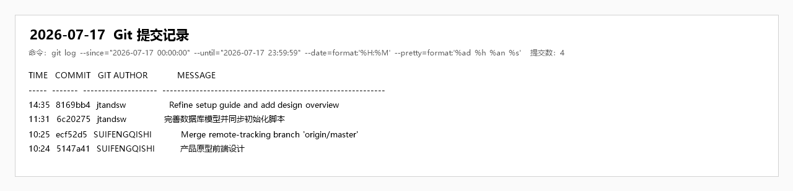

# 企业智慧招聘 OA 软件项目开发日志

## 一、基本信息

| 项目 | 内容 |
| --- | --- |
| 日期 | 2026 年 7 月 17 日 |
| 开发日 | Day 3（第三日） |
| 所属阶段 | 阶段二：基础开发 |
| 当日主题 | 职位管理、数据库模型完善、前端产品原型 |
| 阶段目标 | 为 M3 核心 CRUD 验收准备职位模块 |

## 二、当日目标

1. 完成职位实体、Mapper、Service 和 CRUD 接口设计。
2. 定义职位分页、详情、发布、下架和筛选能力。
3. 完成 HR 职位发布与管理页面、求职者职位浏览页面原型。
4. 完善数据库模型、外键、索引和初始化数据。
5. 对职位管理流程执行功能检查并更新接口文档。

## 三、人员分工与完成情况

| 负责人 | 角色 | 当日计划 | 完成情况 |
| --- | --- | --- | --- |
| 牛泽政 | 项目组长 / 项目经理 | 职位实体、业务层、发布修改删除接口、代码审查 | 完成职位领域结构和接口评审；明确职位状态及发布流程 |
| 张宇阳 | 后端开发工程师 | 分页、详情、列表、状态接口和测试数据 | 完成职位实体、Mapper、Controller 路由及数据库表；持久化业务仍在开发 |
| 刘政 | 前端开发工程师 | 职位表单、列表、筛选、编辑删除和详情页 | 完成多角色产品原型及职位相关页面骨架，建立 API 调用模块 |
| 唐明轩 | 测试 / 文档负责人 | 职位功能测试、用例更新、日报 | 整理职位状态流转、筛选、必填字段和权限边界测试项 |

## 四、开发工作记录

### 4.1 职位领域设计

- 建立 `Job` 实体和 `JobMapper`，字段覆盖职位名称、部门、类别、城市、薪资、学历、经验、描述、要求及状态。
- 定义职位列表、详情、创建、更新、发布和下架接口。
- 约定职位状态至少包含草稿、招聘中和已下架三类状态。
- 明确 HR 可发布和管理职位，求职者仅浏览已发布职位。
- 为职位状态、城市和发布时间规划查询索引。

### 4.2 数据库模型完善

- 在五类核心业务表基础上补充公司、教育经历、工作经历、角色权限和操作日志等表。
- 细化字段类型、非空约束、默认值、逻辑删除和时间字段。
- 为 `job_application` 增加职位与用户联合唯一约束，防止重复投递。
- 同步更新 `sql/init.sql` 和 README 中的数据库字段说明。
- 增加基础角色、权限及演示用户数据设计。

### 4.3 前端职位页面

- 完成 HR 职位列表和职位编辑页面结构。
- 完成求职者职位列表、职位详情及首页推荐区域骨架。
- 在列表页规划关键词、地点、类别和状态筛选控件。
- 建立 `src/api/job.js`，统一维护职位接口地址。
- 完成主导航、角色菜单和页面布局的产品原型设计。

### 4.4 接口与页面联调状态

- 前后端职位接口名称和路径已对齐。
- Controller 已提供完整路由，但创建、更新、发布等真实数据库逻辑仍为 TODO。
- 前端职位页面已具备表单和表格结构，保存、删除、发布等操作仍需接入真实接口。
- 为降低阻塞，页面使用静态示例数据验证布局和交互结构。

### 4.5 测试记录

- 检查职位标题、部门、薪资、学历、经验等表单字段完整性。
- 检查草稿、发布、下架状态转换规则。
- 检查求职者不可访问 HR 编辑页面的路由边界。
- 检查列表筛选条件与后端查询参数命名一致性。
- 发现真实 CRUD 尚未闭环，记录为 M3 验收前阻断项。

## 五、当日交付物

1. 职位实体、Mapper 和 Controller 路由骨架。
2. 职位表及相关数据库索引、初始化数据。
3. HR 职位列表、职位编辑页面原型。
4. 求职者职位列表和详情页面原型。
5. 前端职位 API 模块。
6. 完善后的数据库设计和启动说明。

## 六、验证与阶段结果

| 验证项 | 结果 | 说明 |
| --- | --- | --- |
| 职位数据模型 | 通过 | 字段、状态及表结构已定义 |
| 职位接口契约 | 通过 | 列表、详情、创建、更新、发布、下架路径已统一 |
| 职位页面原型 | 通过 | HR 和求职者页面结构已完成 |
| 真实职位 CRUD | 进行中 | Service 和数据库操作尚待补充 |
| 权限隔离 | 基础通过 | 路由按角色划分，后端方法级权限仍需加强 |
| M3 准备情况 | 部分完成 | 数据模型与页面完成，真实业务闭环待 7 月 18 日继续 |

## 七、问题与处理记录

### 7.1 计划中的 Position 与仓库 Job 命名不一致

统一采用招聘领域更直观的 `Job` 命名，接口前缀统一为 `/api/job`，数据库表使用 `job`。

### 7.2 页面开发快于后端业务实现

先冻结接口契约并完成 UI 原型，待 Service 完成后直接替换静态数据；同时规划 Mock 数据以支持独立演示。

### 7.3 数据库表数量超过首版计划

将新增表限定为核心业务必要的关联表，并通过外键、索引和统一时间字段控制模型复杂度。

## 八、当日总结

第三日完成了职位模块的数据模型、接口契约和前端页面原型，数据库设计也得到进一步细化。当前职位管理已具备展示和联调基础，但真实持久化逻辑尚未完成，下一日需要结合简历模块和 Mock 方案推进 M3 核心 CRUD 验收。

## 九、次日计划（2026 年 7 月 18 日）

1. 完成简历实体、Mapper、接口和文件存储配置。
2. 实现简历上传、列表、详情、删除等接口骨架。
3. 开发简历上传、编辑、列表和详情页面。
4. 统一列表 API 格式，补充 CORS、Nacos 和 AI 服务基础配置。
5. 建立可独立运行的 Mock 数据链路，降低真实后端未完成造成的演示风险。

## 十、Git 作者与实际开发人员对应声明

本文中的“Git 作者”指 Git 提交记录中的作者显示名，不一定等同于开发日志“负责人”字段。对应关系如下：

| Git 提交作者 | 实际开发人员 |
| --- | --- |
| trol | 张宇阳 |
| Yuyang Zhang | 张宇阳 |
| jtandsw | 刘政 |
| SUIFENGQISHI | 牛泽政 |
| Peter-Griffin-coder | 唐明轩 |

## 十一、当日提交索引

当日共有 4 条 Git 提交，其中前端、数据库和文档提交 3 条、合并提交 1 条。

| 时间 | 提交 | Git 作者 | 类型 | 内容 |
| --- | --- | --- | --- | --- |
| 10:24 | `5147a41` | SUIFENGQISHI | 前端 | 完成产品原型前端设计 |
| 10:25 | `ecf52d5` | SUIFENGQISHI | 合并 | 合并远程跟踪分支 `origin/master` |
| 11:31 | `6c20275` | jtandsw | 数据库 | 完善数据库模型并同步初始化脚本 |
| 14:35 | `8169bb4` | jtandsw | 文档 | 完善环境搭建指南并新增概要设计说明 |

### Git 提交截图佐证

