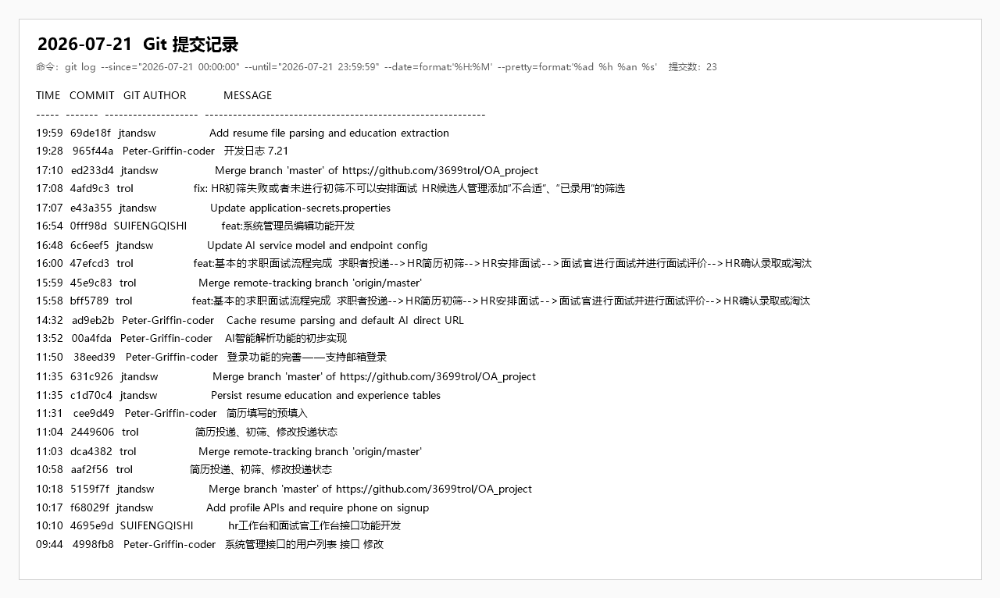

# 企业智慧招聘 OA 软件项目开发日志

## 一、基本信息

| 项目 | 内容 |
| --- | --- |
| 日期 | 2026 年 7 月 21 日 |
| 开发安排 | 7 月 20–21 日复盘优化期（Day 5 与 Day 6 之间） |
| 所属阶段 | 阶段二收尾 / 阶段三准备 |
| 当日主题 | 招聘业务闭环、简历持久化、AI 简历解析、工作台及系统管理完善 |
| 计划依据 | 《企业智慧招聘 OA 软件项目开发计划》及 7 月 20 日遗留任务 |
| 里程碑状态 | M2、M3 关键链路继续补齐；M4 仍未达成；M5 提前启动 |

## 二、计划目标

开发计划将 7 月 20–21 日安排为复盘优化期，7 月 21 日继续执行以下任务：

1. 整理接口文档，复盘项目进度并调整下一阶段计划。
2. 准备 AI 接口测试和 Mock JSON，优化已有业务接口。
3. 优化前端 UI 细节和交互体验，检查跨浏览器兼容性。
4. 完善测试用例，准备职位与简历演示数据，编写用户手册初稿。
5. 处理 7 月 20 日遗留的认证、简历、投递、面试、AI 服务构建和 Elasticsearch 搜索问题。

## 三、提交概览

当日共产生 **21 条 Git 提交**，其中功能、修复及配置提交 16 条，分支合并提交 5 条。以当日首条提交的父版本和当日收盘版本比较，共涉及 82 个文件，新增 4201 行、删除 386 行。

| Git 账号 | 非合并提交数 | 主要工作 |
| --- | ---: | --- |
| Peter-Griffin-coder | 5 | 系统用户列表、简历预填、邮箱登录、AI 简历解析与缓存 |
| trol | 5 | 投递初筛、面试安排、面试评价、录用淘汰及流程校验 |
| jtandsw | 4 | 个人资料、简历经历持久化、AI 模型与端点配置 |
| SUIFENGQISHI | 2 | HR/面试官工作台、管理员用户与角色编辑 |

## 四、人员分工与完成情况

| 负责人 | 计划角色 | 当日实际工作 | 完成情况 |
| --- | --- | --- | --- |
| 牛泽政 | 项目组长 / 项目经理 | 完善系统用户列表；支持简历编辑预填和邮箱登录；搭建 OpenAI Responses 客户端、结构化 Schema、Feign 转发、简历解析诊断与缓存；更新 README 和 API 文档 | AI 攻坚任务提前启动，简历解析链路及单元测试可运行；项目复盘体现在日志和接口状态中，但 Mock 降级开关、Mock JSON 及 ES 搜索仍未完成 |
| 张宇阳 | 后端开发工程师 | 实现职位投递、HR 初筛、候选人详情、面试安排、面试官任务与评价、HR 录用/淘汰等流程；补充不合适和已录用筛选及初筛校验 | 基本招聘流程代码闭环完成并可编译；真实数据库端到端联调及更严格的角色、状态机校验仍需补充 |
| 刘政 | 前端开发工程师 | 增加当前用户资料修改和注册手机号；持久化简历教育及工作经历；调整 AI 服务模型、端点和密钥配置 | 个人资料和简历结构化存储能力完成；AI 配置可被服务读取，但提交真实密钥形成严重安全风险 |
| 唐明轩 | 测试 / 文档负责人 | 开发 HR、面试官工作台统计接口及页面；完善管理员用户、角色编辑接口和页面；同步更新 API 文档 | 工作台和系统管理功能可编译；当日未提交完整测试用例文档、演示数据或用户手册初稿 |

## 五、开发工作记录

### 5.1 认证与个人资料

- 登录接口从仅支持用户名扩展为支持“用户名或邮箱”登录，前端同步调整输入提示。
- 注册请求增加手机号必填字段，前端注册表单同步提交手机号。
- 增加当前用户资料修改接口，可维护真实姓名、手机号和邮箱。
- 主布局增加个人资料编辑交互，并在修改成功后刷新本地用户信息。
- API 文档将登录、注册、当前用户、退出、修改密码和资料修改标记为已开发；刷新 Token 仍未实现。

### 5.2 简历编辑与结构化持久化

- 简历编辑页支持读取已有简历数据并预填基本信息、教育经历和工作经历。
- 新增 `ResumeEducationMapper` 与 `ResumeExperienceMapper`，建立简历子表持久化能力。
- `ResumeServiceImpl` 在事务中保存简历主体，并重建对应教育和工作经历明细，保证结构化数据同步。
- 查询“我的简历”时组装教育、工作经历数据，前后端字段进一步对齐。
- 当前简历保存与更新已实现，但按简历 ID 查询、核心服务内的 `/api/resume/{id}/parse` 和评估接口仍为占位。

### 5.3 职位投递与 HR 初筛

- 实现求职者投递职位、查询个人投递记录及 HR 查询候选人列表的业务逻辑。
- 增加候选人详情数据聚合，展示用户、职位、投递和简历信息。
- HR 可修改投递状态，候选人页面接入初筛及状态变更操作。
- 候选人列表增加“不合适”和“已录用”筛选，便于 HR 按招聘结果查看记录。
- 创建面试前增加投递状态校验，未初筛、初筛失败或已撤回的候选人不能安排面试。

### 5.4 面试管理全流程

- 新增面试 Service，覆盖面试创建、列表、详情、取消、面试官任务列表和历史记录查询。
- 面试创建可选择投递记录、面试官、时间、方式和地址，并关联候选人及职位信息。
- 面试官可查看任务详情、提交或更新评价，评价提交后面试状态更新为已完成。
- HR 可在面试详情中查看评价，并最终确认录用或淘汰，形成“投递—初筛—安排面试—面试评价—录用/淘汰”的基本链路。
- 前端新增 HR 面试详情页，完善面试创建、列表以及面试官任务、详情、评价和历史页面。
- 正式面试题的 AI 生成、保存和按面试查询接口仍为 TODO，未纳入本次流程完成范围。

### 5.5 AI 服务初步实现

- 移除未能解析的 Spring AI M1 依赖，改用 OkHttp 调用 OpenAI Responses 兼容接口，解决前一日 AI 服务构建阻断。
- 新增统一 AI 客户端、模型配置、网络重试、代理回退和 JSON Schema 结构化输出能力。
- 实现简历结构化解析与诊断，返回基本信息、教育、经历、技能、质量评分、问题、优势和优化建议。
- 核心服务通过 Feign 转发 `/api/ai/resume/parse`、`/api/ai/match` 和 `/api/ai/question/generate` 请求至独立 AI 服务。
- 初步实现人岗匹配和面试题生成 Service，并对分数范围、题目数量和必填内容进行校验；接口文档仍将二者标记为“开发过但存在问题”。
- 对相同简历内容采用 SHA-256 缓存键，在进程内缓存 15 分钟，最多保留 200 条，减少重复模型调用。
- 新增 AI 客户端和简历缓存测试，共 3 个单元测试。

### 5.6 工作台与系统管理

- 新增 HR 工作台统计 Service，聚合职位、简历、待筛选、面试、录用和趋势等数据。
- 新增面试官工作台统计，按当前登录面试官汇总待处理、已完成等任务数据。
- 完善管理员用户列表分页、字段搜索、用户类型、启用状态和删除状态筛选。
- 增加管理员用户详情、编辑、重置密码、逻辑删除和恢复能力，`UserController` 增加管理员角色限制。
- 增加角色详情和编辑接口，前端角色、用户管理页接入真实接口并完善编辑交互。
- API 文档同步更新认证、系统管理、简历、投递、面试、AI 和工作台接口状态。

### 5.7 原计划未完成项核查

- 未提交计划要求的 AI Mock JSON，也未实现 `ai.mock.enabled` 一键切换真实调用与 Mock 降级。
- 未发现跨浏览器兼容性检查记录。
- 除 AI 服务 3 个单元测试外，未增加认证、简历、投递、面试、工作台或系统管理自动化测试。
- 当日提交未包含计划要求的职位/简历演示数据和用户手册初稿。
- Elasticsearch 职位搜索、简历搜索及重建索引仍为 TODO，M4 继续延期。

## 六、模块影响范围

| 模块 | 当日变更情况 |
| --- | --- |
| 根目录 / 文档 | 调整 `.gitignore`，更新项目 README 和 API 文档 |
| `recruitment-backend` | 调整父 POM，AI 服务不再依赖无法解析的 Spring AI M1 组件 |
| `recruitment-service` | 覆盖认证、简历、投递、面试、工作台、系统管理及 AI 转发，是当日主要后端变更模块 |
| `recruitment-api` | 扩展 AI 简历解析响应 DTO |
| `recruitment-common` | 全局异常处理增加业务异常兼容 |
| `recruitment-ai-service` | 新增 AI 客户端、结构化 Schema、简历解析、人岗匹配、面试题生成、缓存及单元测试 |
| `recruitment-web` | 覆盖个人资料、简历、候选人、面试、工作台、用户和角色管理页面 |
| `sql` | 调整投递记录的 `resume_id` 默认值 |

## 七、当日交付物

1. 支持邮箱登录、手机号注册和当前用户资料编辑的认证增强功能。
2. 简历基本信息、教育经历和工作经历的预填及事务化持久化能力。
3. 求职者投递、HR 初筛、面试安排、面试官评价、HR 录用或淘汰的基本招聘流程。
4. HR 和面试官工作台统计接口及对应页面联动。
5. 管理员用户查询、编辑、重置、删除、恢复和角色编辑功能。
6. 独立 AI 服务的 Responses API 客户端、结构化简历解析诊断及进程内缓存。
7. 更新后的 README、API 状态文档和 AI 服务单元测试。

## 八、验证结果

| 验证项 | 结果 | 说明 |
| --- | --- | --- |
| 前端生产构建 | 通过 | `npm.cmd run build` 成功，转换 1733 个模块 |
| 前端产物体积 | 警告 | 主 JavaScript 分包约 1.20 MB，超过 Vite 500 kB 建议阈值 |
| 后端全量干净构建 | 通过 | 在当日收盘提交 `ed233d4` 的独立工作树执行 `mvn.cmd clean test`，9 个 Maven 模块全部成功 |
| AI 单元测试 | 通过 | 共 3 个测试，失败 0、错误 0、跳过 0，覆盖客户端结构化响应和简历缓存 |
| 核心业务自动化测试 | 缺失 | 认证、简历、投递、面试、工作台及系统管理模块均无测试用例 |
| 数据库与真实接口联调 | 未验证 | 未启动 MySQL、Nacos 和双服务执行端到端请求 |
| 真实 AI 调用 | 未验证 | 单元测试使用 MockWebServer/Mock 客户端，不代表外部模型端点稳定可用 |
| Elasticsearch 搜索 | 未通过 | 搜索和重建索引接口仍为占位实现 |

## 九、计划完成度对照

| 计划项 | 状态 | 当日结果 |
| --- | --- | --- |
| 接口文档整理 | 完成 | 多次更新 API 状态，补充用户列表查询及 AI 配置说明 |
| 项目进度复盘与计划调整 | 部分完成 | 已明确基础闭环和 AI 进展，但未单独提交下周计划文档 |
| 接口优化 | 超额推进 | 认证、简历、投递、面试、工作台和系统管理均有实质实现 |
| AI 接口测试准备 | 部分完成 | 新增 AI 客户端和 3 个单元测试，真实模型联调未留存验收结果 |
| AI Mock JSON 与降级开关 | 未完成 | 当前实现依赖真实模型配置，不符合计划中的 Mock 降级要求 |
| UI 与交互优化 | 部分完成 | 多个业务页面完成真实接口接入，未见跨浏览器检查证据 |
| 测试用例完善 | 部分完成 | 仅 AI 服务新增单元测试，核心招聘流程没有自动化覆盖 |
| 演示数据准备 | 未完成 | 当日提交未增加成套职位与简历演示数据 |
| 用户手册初稿 | 未完成 | 无对应提交 |
| M2 登录闭环 | 基本完成 | 支持用户名/邮箱登录、资料维护且后端可编译，仍缺真实数据库联调 |
| M3 核心 CRUD | 基本完成 | 职位、简历保存、投递和面试主流程已实现；文件和部分详情接口仍有占位 |
| M4 搜索可用 | 未完成 | ES 索引、Repository、同步和查询均未实现 |
| M5 AI 核心链路 | 提前启动 | 简历解析可运行，人岗匹配和面试题生成处于待联调状态 |

## 十、问题与风险

### 10.1 API Key 已进入 Git 历史

`application-secrets.properties` 已被 Git 跟踪，且包含非占位 API Key。即使后续删除文件，密钥仍存在于提交历史中。应立即在供应商侧吊销并轮换该 Key，将密钥改为环境变量或本地忽略文件，并清理远程仓库历史；仓库中仅保留无敏感值的 `.example` 模板。

### 10.2 缺少 Mock 降级，与开发计划的 R1 应急方案不一致

计划要求通过 `ai.mock.enabled` 在真实模型与 Mock 数据之间切换，但当日实现直接依赖外部模型和中转端点。网络、配额或 Key 异常会阻断演示，应在 7 月 22 日优先补齐 Mock 响应和超时降级。

### 10.3 招聘流程授权与状态机校验不足

部分投递、面试、工作台和角色接口只要求登录，缺少明确的 HR、面试官或管理员方法级授权；投递状态更新也可直接写入传入值。应增加角色校验、合法状态迁移表、资源归属检查和操作日志，避免越权修改招聘结果。

### 10.4 “流程完成”尚缺端到端测试证据

当天完成了业务代码和页面链路，但未使用真实 MySQL、Nacos、核心服务和 AI 服务执行完整流程。当前只能确认代码可干净编译、前端可构建及 AI 单元测试通过，不能替代业务验收。

### 10.5 M4 搜索继续延期

Elasticsearch 职位搜索、简历搜索和重建索引仍为 TODO。M5 已提前启动，但计划中的 M4 尚未达成，可能在后续联调阶段形成搜索与匹配能力断层。

### 10.6 前端主分包偏大

前端构建主分包约 1.20 MB。虽然不阻断当前演示，但会影响首屏加载，应对 Element Plus 和业务页面进行按需加载或手动分包。

## 十一、当日总结

7 月 21 日实际工作从“复盘优化”扩展为核心业务补齐和 AI 能力提前开发。当天打通了求职者投递、HR 初筛、面试安排、面试官评价以及 HR 录用/淘汰的基本招聘链路，同时完善了简历结构化持久化、个人资料、工作台和系统管理。AI 服务摆脱了前一日 Spring AI 依赖阻断，形成基于 Responses API 的结构化调用、简历解析诊断和缓存能力，后端全量干净构建及 3 个 AI 单元测试均通过。

但项目仍不能视为已完成联调验收。核心招聘流程缺少数据库端到端测试，ES 搜索继续延期，Mock 降级方案、演示数据和用户手册未按计划交付，且真实 API Key 被提交到 Git，构成当前最高优先级安全问题。7 月 22 日进入 AI 攻坚阶段前，应先完成密钥处置、Mock 降级、权限和状态流转加固，再开展真实 AI 与匹配链路联调。

## 十二、后续计划（2026 年 7 月 22 日）

1. 立即吊销并轮换已提交的 API Key，将敏感配置迁移到环境变量或本地忽略文件，提交安全配置模板。
2. 按计划实现 `ai.mock.enabled` 开关及简历解析、人岗匹配、面试题生成的完整 Mock JSON，确保离线演示可用。
3. 启动 MySQL、Nacos、核心服务和 AI 服务，回归“登录—简历—投递—初筛—面试—评价—录用/淘汰”全流程。
4. 为投递和面试接口补充 HR、面试官、求职者的角色授权、资源归属校验和合法状态迁移规则。
5. 联调 AI 简历解析，将解析结果可靠回填并保存到简历结构化字段；验证超时、重试和异常提示。
6. 完成人岗匹配及面试题生成真实/Mock 双模式测试，按结果校正 API 文档状态。
7. 补充认证、简历、投递和面试的最小自动化测试，避免以编译通过替代业务验收。
8. 恢复 Elasticsearch 索引、Repository、数据同步和搜索查询工作，重新评估 M4 完成时间。
9. 补齐演示职位、简历数据和用户手册初稿，完成复盘优化期遗留交付物。

## 十三、Git 作者与实际开发人员对应声明

本文中的“Git 作者”指 Git 提交记录中的作者显示名，不一定等同于开发日志“负责人”字段。对应关系如下：

| Git 提交作者 | 实际开发人员 |
| --- | --- |
| trol | 张宇阳 |
| Yuyang Zhang | 张宇阳 |
| jtandsw | 刘政 |
| SUIFENGQISHI | 牛泽政 |
| Peter-Griffin-coder | 唐明轩 |

## 十四、当日提交索引

| 时间 | 提交 | Git 作者 | 类型 | 内容 |
| --- | --- | --- | --- | --- |
| 09:44 | `4998fb8` | Peter-Griffin-coder | 系统管理 | 完善管理员用户列表接口和页面 |
| 10:10 | `4695e9d` | SUIFENGQISHI | 工作台 | 开发 HR 和面试官工作台接口 |
| 10:17 | `f68029f` | jtandsw | 认证 | 增加个人资料 API，注册要求手机号 |
| 10:18 | `5159f7f` | jtandsw | 合并 | 合并远程 `master` |
| 10:58 | `aaf2f56` | trol | 投递 | 实现简历投递、初筛和状态修改后端逻辑 |
| 11:03 | `dca4382` | trol | 合并 | 合并远程跟踪分支 `origin/master` |
| 11:04 | `2449606` | trol | 前端 | 完善 HR 候选人详情、初筛和状态操作 |
| 11:31 | `cee9d49` | Peter-Griffin-coder | 简历 | 简历编辑页读取已有数据并预填 |
| 11:35 | `c1d70c4` | jtandsw | 简历 | 持久化教育经历和工作经历子表 |
| 11:35 | `631c926` | jtandsw | 合并 | 合并远程 `master` |
| 11:50 | `38eed39` | Peter-Griffin-coder | 认证 | 登录功能支持邮箱 |
| 13:52 | `00a4fda` | Peter-Griffin-coder | AI | 初步实现 AI 简历解析、匹配和面试题能力 |
| 14:32 | `ad9eb2b` | Peter-Griffin-coder | AI/测试 | 增加简历解析缓存、直连默认配置和缓存测试 |
| 15:58 | `bff5789` | trol | 面试 | 实现投递至录用/淘汰的基本招聘流程 |
| 15:59 | `45e9c83` | trol | 合并 | 合并远程跟踪分支 `origin/master` |
| 16:00 | `47efcd3` | trol | 前端 | 完善面试官评价页面及流程交互 |
| 16:48 | `6c6eef5` | jtandsw | 配置 | 调整 AI 服务模型和端点配置 |
| 16:54 | `0fff98d` | SUIFENGQISHI | 系统管理 | 开发管理员用户和角色编辑功能 |
| 17:07 | `e43a355` | jtandsw | 配置 | 更新 AI 服务密钥配置 |
| 17:08 | `4afd9c3` | trol | 修复 | 限制未通过初筛者安排面试，增加结果筛选 |
| 17:10 | `ed233d4` | jtandsw | 合并 | 合并远程 `master` |

### Git 提交截图佐证

