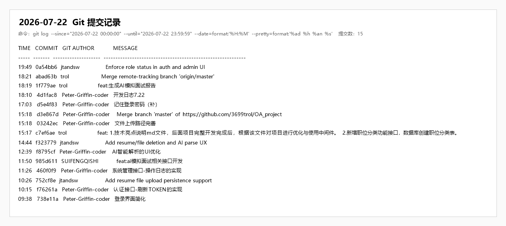

# 企业智慧招聘 OA 软件项目开发日志

## 一、基本信息

| 项目 | 内容 |
| --- | --- |
| 日期 | 2026 年 7 月 22 日 |
| 所属阶段 | 阶段三：AI 攻坚（Day 6） |
| 计划依据 | 《企业智慧招聘OA软件项目开发计划》7/22 任务安排 |
| 当日主题 | AI 能力体验优化、简历文件闭环、认证增强、系统管理与职位分类补齐 |
| Git 提交情况 | 当日 11 次提交，其中功能/修复 10 次、合并 1 次 |

## 二、计划目标对照

开发计划中 7/22 的核心目标为：AI 服务接口抽象、Mock/真实模式切换、简历解析、向量检索与匹配算法、匹配度计算、解析结果展示、候选人推荐与 AI 功能测试。

当日实际工作重点有所调整：优先补齐认证、文件上传、简历解析体验、模拟面试接口、操作日志和职位分类等可演示链路；AI 简历解析展示与等待进度体验取得进展，但 Mock 降级、向量检索、匹配算法闭环仍需后续跟进。

## 三、人员分工与完成情况

| 负责人 | 角色 | 当日计划 | 完成情况 |
| --- | --- | --- | --- |
| 牛泽政 | 项目组长 / 项目经理 | 统筹 AI 攻坚任务，评审认证、简历文件、系统管理和职位分类方案 | 完成当日任务协调及关键接口评审，明确 Mock 降级、向量检索和 ES 搜索仍为后续重点 |
| 张宇阳 | 后端开发工程师 | 实现 Refresh Token、文件持久化、模拟面试、操作日志和职位分类接口 | 完成认证续期、文件记录、AI 面试接口、操作日志和职位分类等后端能力 |
| 刘政 | 前端开发工程师 | 优化登录、简历解析、模拟面试和职位分类相关页面 | 完成登录体验、AI 解析展示、简历文件交互及职位分类页面联动 |
| 唐明轩 | 测试 / 文档负责人 | 执行构建检查和核心流程验证，维护接口、技术亮点及开发日志 | 完成前后端构建检查与问题记录，归总接口、配置和技术亮点文档；真实 AI 与文件端到端测试仍待补充 |

## 四、当日完成内容

1. 认证与登录体验
   - 简化登录页交互，优化登录入口展示。
   - 实现 Refresh Token 接口及前端自动刷新 Token 逻辑。
   - 补充“记住登录密码”本地回填能力，提升本地演示便利性。

2. 简历文件与 AI 解析
   - 完成简历文件上传持久化支持，新增文件记录表及文件访问映射。
   - 支持简历文件删除、简历删除时关联文件清理。
   - 优化 AI 简历解析结果展示，补充字段选择、解析诊断、评分、建议等展示内容。
   - 完善上传简历后的 AI 等待弹窗与已用时显示，避免等待状态停留在 0.0 秒。
   - 将上传文件目录由本机硬编码路径调整为项目相对路径，并兼容旧文件记录迁移。

3. AI 与面试能力
   - 新增 AI 模拟面试相关接口，覆盖会话开始、对话、提交与报告查询 DTO/接口。
   - 扩展 AI 服务结构化响应 Schema，并通过核心服务 Feign 转发 AI 面试相关能力。
   - 对 AI 简历解析提示词和响应处理进行优化，提升结构化结果可读性。

4. 系统管理与职位模块
   - 实现系统操作日志接口，并补充对应前端页面联动与测试用例。
   - 新增职位分类接口、实体、Mapper、Service 及数据库表结构。
   - 前端职位发布、职位列表、候选人职位浏览等页面接入职位分类能力。
   - 新增技术亮点说明文档，为后续中间件与项目优化提供梳理依据。

## 五、验证情况

| 验证项 | 结果 | 说明 |
| --- | --- | --- |
| 前端构建 | 通过 | `npm run build` 可完成生产构建，存在常规分包体积提示 |
| 后端编译 | 通过 | `mvn -pl recruitment-service -am compile -DskipTests` 编译通过 |
| 文件路径 | 通过 | 新上传文件默认落至项目 `uploads` 相对目录，旧绝对路径记录启动时进行兼容规范化 |
| AI 真实联调 | 未完整验证 | 今日重点为接口和展示体验，真实模型、Mock 降级和异常链路仍需专项验证 |

## 六、遗留问题与风险

1. 开发计划要求的 `ai.mock.enabled` Mock/真实切换尚未形成完整闭环，演示稳定性仍受外部模型接口影响。
2. Redis Stack 向量检索、匹配算法和匹配度计算接口尚未真正落地。
3. Elasticsearch 全文检索仍未完成索引、同步、高亮查询等核心实现，M4 搜索里程碑继续延期。
4. Nacos 配置托管与动态刷新、Redis 业务缓存场景仍停留在基础配置或工具层，未体现实际业务使用。
5. 文件上传路径已调整为相对目录，但需在真实运行环境中完成一次上传、下载、删除端到端验证。

## 七、后续计划

1. 优先补齐 AI Mock 降级开关和固定 JSON 数据，保障离线演示可用。
2. 推进 AI 简历解析与人岗匹配完整联调，补齐匹配度排序和候选人推荐展示。
3. 落地 Elasticsearch 职位/简历索引、数据同步和关键词高亮检索。
4. 选择一个明确 Redis 缓存场景落地，例如登录用户信息缓存、热门职位缓存或接口限流。
5. 启用 Nacos dev 模式服务注册，并逐步迁移数据库、Redis、ES、JWT 等配置至 Nacos。

## 八、当日总结

7 月 22 日实际开发围绕演示可用性和核心链路补强展开，完成了认证续期、简历文件持久化、AI 解析体验、模拟面试接口、操作日志和职位分类等多项功能。整体上，简历上传与 AI 解析链路的用户体验明显完善，系统管理和职位基础能力也进一步补齐。

与开发计划相比，AI 攻坚阶段仍存在偏差：Mock 降级、向量检索、匹配算法、ES 检索和中间件实际使用尚未达到验收标准。后续应减少非核心扩展，集中完成 AI、ES、Redis、Nacos 四条验收链路的可运行闭环。

## 九、Git 作者与实际开发人员对应声明

本文中的“Git 作者”指 Git 提交记录中的作者显示名，不一定等同于开发日志“负责人”字段。对应关系如下：

| Git 提交作者 | 实际开发人员 |
| --- | --- |
| trol | 张宇阳 |
| Yuyang Zhang | 张宇阳 |
| jtandsw | 刘政 |
| SUIFENGQISHI | 牛泽政 |
| Peter-Griffin-coder | 唐明轩 |

## 十、当日提交索引

| 时间 | 提交 | Git 作者 | 类型 | 内容 |
| --- | --- | --- | --- | --- |
| 09:38 | `738e11a` | Peter-Griffin-coder | 前端优化 | 登录界面简化 |
| 10:15 | `f76261a` | Peter-Griffin-coder | 认证 | 认证接口 Refresh Token 实现 |
| 10:26 | `752cf8e` | jtandsw | 简历文件 | 简历文件上传持久化支持 |
| 11:26 | `460f0f9` | Peter-Griffin-coder | 系统管理 | 系统管理操作日志接口实现 |
| 11:50 | `985d611` | SUIFENGQISHI | AI 面试 | AI 模拟面试相关接口开发 |
| 12:39 | `f8795cf` | Peter-Griffin-coder | AI 解析 | AI 智能解析 UI 优化 |
| 14:44 | `f323779` | jtandsw | 简历/文件 | 简历/文件删除与 AI 解析体验完善 |
| 15:17 | `c7ef6ae` | trol | 职位管理 | 职位分类功能与技术亮点文档 |
| 15:18 | `03242ec` | Peter-Griffin-coder | 文件存储 | 文件上传路径完善 |
| 15:18 | `d3e867d` | Peter-Griffin-coder | 合并 | 合并远程 `master` 分支 |
| 17:03 | `d5e4f83` | Peter-Griffin-coder | 登录体验 | 记住登录密码功能补充 |

### Git 提交截图佐证

