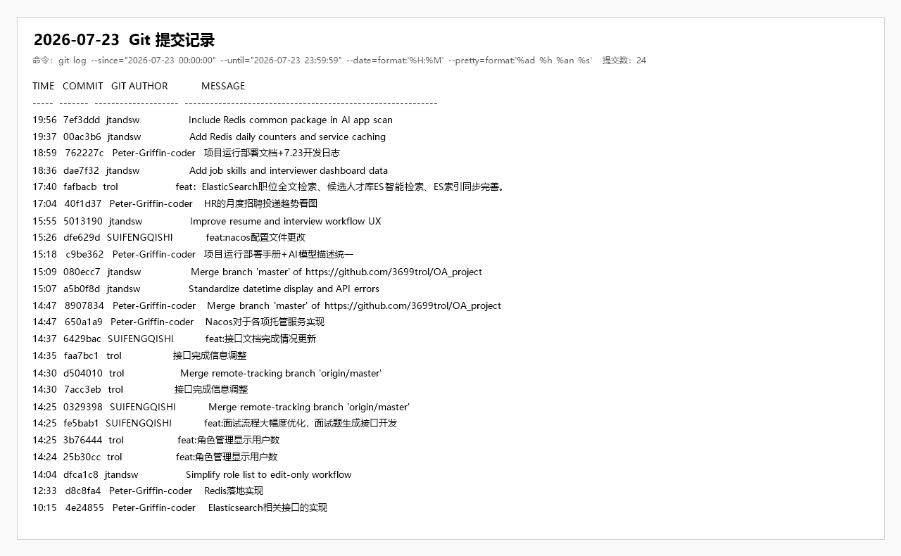

# 企业智慧招聘 OA 软件项目开发日志

## 一、基本信息

| 项目 | 内容 |
| --- | --- |
| 日期 | 2026 年 7 月 23 日 |
| 所属阶段 | 阶段三：AI 攻坚（Day 7） |
| 计划依据 | 《企业智慧招聘OA软件项目开发计划》7/23 任务安排及 M5 里程碑要求 |
| 当日主题 | 面试题生成与面试流程完善、Elasticsearch 检索闭环、Redis/Nacos 基础设施落地、招聘看板数据增强 |
| Git 提交情况 | 当日 21 次提交，其中功能/优化/文档配置 17 次、合并 4 次 |

## 二、计划目标对照

开发计划中 7/23 的核心目标为：面试题生成提示词模板设计、AI 生成面试题接口、面试安排/状态更新/评价/列表接口、匹配算法优化，以及前端面试题展示页、面试计划列表、面试安排弹窗、评价表单和面试管理全流程测试。

当日实际开发基本围绕面试管理和 AI 面试题链路展开，并同步推进了 Elasticsearch 职位/人才检索、Redis 业务缓存、Nacos 配置托管、接口文档、HR 看板和面试官工作台等内容。与 M5“AI核心链路跑通”的验收标准相比，面试题生成、面试答题、评价、候选人/面试官详情展示已有明显推进；但“简历解析与匹配推荐能返回有效数据（含 Mock 模式）”仍需继续完成真实联调、Mock 降级和稳定演示数据闭环。

## 三、人员分工与完成情况

| 负责人 | 角色 | 当日计划 | 完成情况 |
| --- | --- | --- | --- |
| 牛泽政 | 项目组长 / 项目经理 | 统筹 M5 收口，协调面试、ES、Redis、Nacos与看板链路 | 完成跨模块任务协调和阶段风险梳理，明确 7 月 24 日转入全量联调与缺陷收敛 |
| 张宇阳 | 后端开发工程师 | 完善面试题与评价流程、ES索引同步、Redis缓存、Nacos配置和看板统计 | 完成面试后端链路、中间件接入、搜索同步及仪表板数据增强 |
| 刘政 | 前端开发工程师 | 开发职位/人才搜索、面试答题与评价、岗位技能及工作台页面 | 完成候选人和HR搜索页面、面试流程页面、职位技能展示及面试官工作台优化 |
| 唐明轩 | 测试 / 文档负责人 | 维护API与部署文档，执行构建验证并设计面试全流程回归 | 完成接口状态、技术亮点和部署说明更新；前后端构建通过，真实中间件和面试全流程仍需继续验证 |

## 四、当日完成内容

1. 面试题生成与面试流程
   - 大幅优化面试流程，补充面试题生成接口、正式题目保存接口、候选人查看题目接口、候选人提交答案接口。
   - 前端新增或完善候选人面试答题页、面试官面试详情页、评价页和 AI 生成题目页。
   - 支持面试题与候选人答案联动展示，为后续面试评价和记录追踪提供数据基础。
   - 改进 HR 侧面试创建体验，支持从候选人详情、候选人列表等页面携带投递信息跳转安排面试。

2. Elasticsearch 检索能力
   - 实现职位全文检索相关接口、职位索引文档、搜索 Service 和搜索结果 VO。
   - 补充候选人才库 Elasticsearch 智能检索，扩展简历索引字段和候选人搜索结果字段。
   - 完善职位、简历索引同步逻辑，使职位发布/更新、简历保存等动作能够更好地支撑检索数据一致性。
   - 前端新增候选人职位搜索页和 HR 人才库检索页，支持按关键词检索职位和候选人。

3. Redis 业务落地
   - 完善 Redis 公共模块配置与工具类，补充 Redis 连接、序列化和通用操作能力。
   - 登录认证链路接入 Refresh Token 相关能力，为会话续期和令牌状态管理提供支持。
   - 职位模块接入 Redis 缓存场景，提升职位查询类接口的演示完整度和中间件使用证明。

4. Nacos 配置托管
   - 新增 Nacos 配置目录、公共配置、服务配置和发布脚本。
   - 调整 `recruitment-service`、`recruitment-ai-service` 的 dev/local 配置结构。
   - 增加配置中心缺失时的启动提示与本地配置回退能力，降低本地开发对 Nacos 的强依赖。
   - 统一 AI 模型配置描述，更新 `.env.example`、README、概要设计文档和相关配置文件。

5. HR 看板与面试官工作台
   - 将 HR 月度招聘投递趋势由固定 SVG 样式改为按后端 `monthlyTrend` 数据渲染。
   - 后端仪表板 VO 增加最近 6 个月投递趋势字段，服务端按投递时间统计每月投递数量。
   - 面试官工作台补充待办面试、历史面试、今日/近期任务和相关数据展示。
   - 面试详情页增强候选人信息、职位信息、题目、答案、评价等内容的整合展示。

6. 职位与候选人体验
   - 职位新增技能标签字段，后端 DTO、实体、搜索文档、搜索结果和 SQL 脚本同步扩展。
   - 前端职位发布、职位列表、职位详情和候选人首页展示接入岗位技能信息。
   - 简历与面试流程体验进一步优化，候选人详情页补充更多简历和投递信息展示。
   - 统一日期时间展示工具，减少前端页面中时间格式不一致的问题。

7. 系统管理与文档
   - 角色管理补充用户数展示，简化角色列表编辑流程。
   - 多次更新 API 文档完成情况，持续同步接口实现状态。
   - 新增或更新技术亮点文档，补充 Elasticsearch、Redis、Nacos 等中间件落地说明。
   - 补充项目运行部署相关说明，为后续联调和演示部署做准备。

## 五、验证情况

| 验证项 | 结果 | 说明 |
| --- | --- | --- |
| 前端构建 | 通过 | `npm run build` 可完成生产构建，存在常规大体积 chunk 提示 |
| 后端编译 | 通过 | `mvn -pl recruitment-service -am test -DskipTests` 编译通过；命令跳过了测试执行 |
| ES 相关代码 | 部分验证 | 接口、文档、Service 和前端页面已补齐，仍需连接真实 ES 环境做检索结果和同步一致性验证 |
| Redis/Nacos | 部分验证 | 配置、工具和服务接入完成，仍需在完整 dev 环境验证服务注册、配置发布和缓存命中情况 |
| 面试流程 | 部分验证 | 页面和接口链路已基本完成，需继续做“安排面试 -> AI 出题 -> 候选人作答 -> 面试官评价”的全流程回归 |
| HR 看板趋势 | 部分验证 | 前后端数据结构已接通，需确认运行中的后端已重启并返回 `monthlyTrend` 字段 |

## 六、遗留问题与风险

1. M5 要求的“简历解析与匹配推荐有效数据（含 Mock 模式）”尚未完全闭环，尤其是 Mock 降级、匹配推荐排序和演示数据稳定性仍需补齐。
2. Elasticsearch 代码实现已经明显推进，但真实环境中的索引初始化、数据同步、关键词高亮和人才库检索准确性仍需集中验证。
3. Redis 和 Nacos 已从配置层推进到业务接入层，但仍需要在本地/演示环境完成一次完整启动和连通性确认。
4. 面试题生成依赖 AI 服务可用性，仍存在外部模型超时、Key 失效或结构化字段不稳定的风险。
5. HR 看板趋势图已改为数据驱动，但如果后端未重启或数据库投递时间字段异常，前端仍可能显示 0。
6. 当日提交中合并与多人并行修改较多，后续需要加强回归测试，避免接口字段、路由或状态枚举不一致。

## 七、后续计划

1. 7/24 优先开展全量联调，围绕登录、职位发布、简历上传、AI 解析、职位/人才检索、面试安排、答题评价和看板展示形成可演示主线。
2. 补齐 AI Mock 降级开关和固定演示 JSON，保证无外网或模型异常时仍可稳定演示。
3. 验证 Elasticsearch 索引初始化、职位/简历同步、搜索高亮和人才库检索准确性。
4. 验证 Redis 缓存命中、Refresh Token 续期和 Nacos 配置托管在 dev 环境下的完整启动流程。
5. 完成面试管理全流程测试，重点检查候选人作答、面试官查看答案、参考答案/评分标准保存和评价提交。
6. 根据 7/24 联调结果整理阻断性 Bug 清单，为 7/25 代码冻结和演示准备收敛范围。

## 八、当日总结

7 月 23 日是阶段三 AI 攻坚的收口日，也是 M5“AI核心链路跑通”的目标节点。当日实际完成了面试题生成与面试管理链路的大量开发工作，并同步补强了 Elasticsearch、Redis、Nacos、HR 看板和面试官工作台等关键能力。整体来看，系统从基础 CRUD 和单点页面逐步进入可演示业务闭环阶段。

但从验收角度看，AI 核心链路仍不能简单判定为完全完成：面试题生成能力已推进较多，简历解析、匹配推荐、Mock 降级和真实中间件环境验证仍需要在 7/24 联调冲刺中集中收敛。下一步应减少新增功能，把工作重心转向全流程稳定性、演示数据、异常兜底和文档交付。

## 九、Git 作者与实际开发人员对应声明

本文中的“Git 作者”指 Git 提交记录中的作者显示名，不一定等同于开发日志“负责人”字段。对应关系如下：

| Git 提交作者 | 实际开发人员 |
| --- | --- |
| trol | 张宇阳 |
| Yuyang Zhang | 张宇阳 |
| jtandsw | 刘政 |
| SUIFENGQISHI | 牛泽政 |
| Peter-Griffin-coder | 唐明轩 |

## 十、当日提交索引

| 时间 | 提交 | Git 作者 | 类型 | 内容 |
| --- | --- | --- | --- | --- |
| 10:15 | `4e24855` | Peter-Griffin-coder | ES 检索 | Elasticsearch 相关接口、职位/简历索引文档与搜索服务实现 |
| 12:33 | `d8c8fa4` | Peter-Griffin-coder | Redis | Redis 配置、工具类、认证与职位缓存场景落地 |
| 14:04 | `dfca1c8` | jtandsw | 系统管理 | 简化角色列表为编辑优先流程 |
| 14:24 | `25b30cc` | trol | 角色管理 | 角色实体与服务补充用户数展示 |
| 14:25 | `3b76444` | trol | 角色管理 | 角色用户数 Mapper 查询补充 |
| 14:25 | `fe5bab1` | SUIFENGQISHI | 面试流程 | 面试流程优化、面试题生成接口与前端页面开发 |
| 14:25 | `0329398` | SUIFENGQISHI | 合并 | 合并远程 `master` 分支 |
| 14:30 | `7acc3eb` | trol | 文档 | 接口完成信息调整 |
| 14:30 | `d504010` | trol | 合并 | 合并远程跟踪分支 |
| 14:35 | `faa7bc1` | trol | 文档 | 接口完成信息补充 |
| 14:37 | `6429bac` | SUIFENGQISHI | 文档 | API 文档完成情况更新 |
| 14:47 | `650a1a9` | Peter-Griffin-coder | Nacos | Nacos 配置托管、发布脚本、服务配置和配置回退机制 |
| 14:47 | `8907834` | Peter-Griffin-coder | 合并 | 合并远程 `master` 分支 |
| 15:07 | `a5b0f8d` | jtandsw | 前端规范 | 日期时间展示和 API 错误处理统一 |
| 15:09 | `080ecc7` | jtandsw | 合并 | 合并远程 `master` 分支 |
| 15:18 | `c9be362` | Peter-Griffin-coder | 配置/文档 | 项目运行部署手册与 AI 模型描述统一 |
| 15:26 | `dfe629d` | SUIFENGQISHI | 配置 | Nacos 相关配置文件调整 |
| 15:55 | `5013190` | jtandsw | 体验优化 | 简历与面试工作流体验优化 |
| 17:04 | `40f1d37` | Peter-Griffin-coder | 数据看板 | HR 月度招聘投递趋势改为后端数据驱动 |
| 17:40 | `fafbacb` | trol | ES 检索 | 职位全文检索、候选人才库智能检索和 ES 索引同步完善 |
| 18:36 | `dae7f32` | jtandsw | 岗位/面试官工作台 | 职位技能字段和面试官工作台数据增强 |

### Git 提交截图佐证

