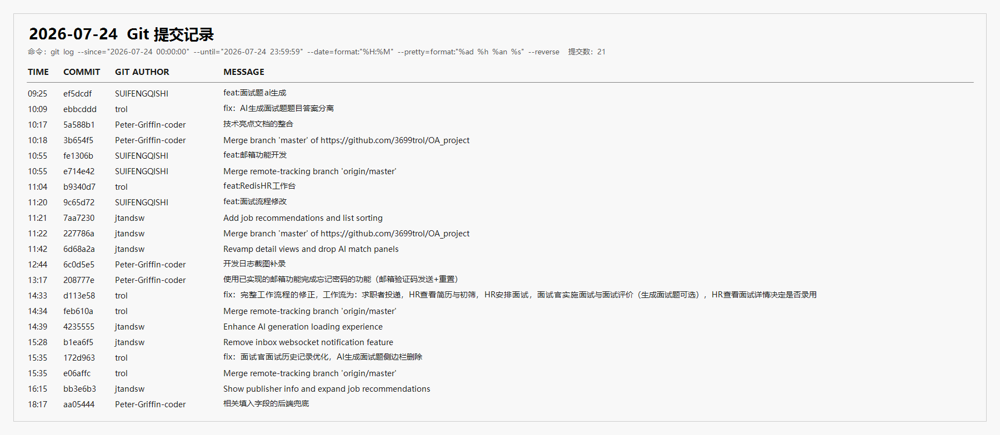

# 企业智慧招聘 OA 软件项目开发日志

## 一、基本信息

| 项目 | 内容 |
| --- | --- |
| 日期 | 2026 年 7 月 24 日 |
| 所属阶段 | 阶段四：测试交付（Day 8） |
| 计划依据 | 《企业智慧招聘OA软件项目开发计划》7/24 全量联调、缺陷收敛与成果交付安排 |
| 当日主题 | 完整招聘流程收口、邮件验证码重置密码、职位推荐与 AI 体验优化、输入校验及最终测试交付 |
| Git 提交情况 | 当日 21 次提交，其中功能/优化/文档 16 次、合并 5 次 |

## 二、计划目标对照

开发计划中 7/24 的重点是从功能开发转入全量联调和交付收口：串联求职者投递、HR 初筛与安排面试、面试官实施面试和评价、HR 决定录用的完整业务流程；验证 AI、Redis、Elasticsearch、Nacos 和邮件服务的接入情况；集中修复影响演示的缺陷，并同步整理测试与项目文档。

当日实际工作与上述目标基本一致。团队完成了招聘和面试主流程修正，补充 AI 面试题生成及题目/答案分离，落地邮件服务和“邮箱验证码 + 新密码”重置流程，完善职位推荐、职位发布者信息、HR 工作台缓存及多处页面体验。测试与文档侧补录 Git 佐证，并针对注册、登录、密码、职位、面试、角色和用户管理等请求增加后端参数校验兜底。项目已具备主要业务演示条件，但测试用例中仍有权限控制、退出登录令牌失效、简历部分接口、文件上传白名单、ES 环境和 Nacos 配置断言等未通过或受环境阻塞项，不能将本日记录表述为全部验收通过。

## 三、人员分工与完成情况

| 负责人 | 角色 | 当日工作 | 完成情况 |
| --- | --- | --- | --- |
| 牛泽政 | 项目组长 / 项目经理 | 推进 AI 面试题、邮件通知和面试流程收口 | 完成 AI 面试题生成、邮件服务开发及面试流程调整，协调整体交付范围 |
| 张宇阳 | 后端开发工程师 | 完善面试题结构、HR 工作台缓存和完整招聘流程 | 完成题目/答案分离、Redis HR 工作台、招聘工作流修正及面试官历史记录优化 |
| 刘政 | 前端开发工程师 | 优化职位推荐、详情页、AI 加载和消息相关体验 | 完成职位推荐与排序、发布者信息展示、详情页调整、AI 加载体验优化及 WebSocket 收件箱功能移除 |
| 唐明轩 | 测试 / 文档负责人 | 整理技术与开发日志材料，完善忘记密码并执行输入校验测试 | 完成技术亮点整合、Git 截图补录、“邮箱验证码 + 新密码”流程、后端输入校验兜底和对应测试 |

## 四、当日完成内容

1. AI 面试题与面试流程收口
   - 完善 AI 面试题生成能力，调整模型响应解析和问题服务逻辑。
   - 将生成结果中的题目与参考答案分离，便于按候选人和面试官角色控制展示内容。
   - 修正“求职者投递 -> HR 初筛 -> HR 安排面试 -> 面试官实施面试与评价 -> HR 查看详情并决定录用”的主流程。
   - 优化面试官历史记录，删除不再需要的 AI 题目侧栏，减少重复入口和页面干扰。

2. 邮件服务与忘记密码
   - 在现有邮件能力基础上补充邮件配置、发送服务及面试相关通知支撑。
   - 登录页增加重置密码界面，形成“填写注册邮箱 -> 发送验证码 -> 填写验证码和新密码 -> 提交重置”的完整流程。
   - 后端增加验证码发送和密码重置接口，覆盖验证码有效期、发送间隔、尝试次数和密码更新等处理。
   - 调整发送验证码区域的 UI，避免同一邮箱输入或发送入口在页面中重复出现。

3. 职位推荐与候选人页面
   - 增加职位推荐和职位列表排序能力，扩展候选人可见的推荐结果。
   - 职位详情和列表补充发布者信息，增强岗位来源的可识别性。
   - 优化候选人首页、职位列表和职位详情之间的数据展示与跳转体验。
   - 调整详情页布局并移除不成熟的 AI 匹配面板，确保演示内容与当前后端能力一致。

4. 工作台与前端体验
   - HR 工作台统计接入 Redis 缓存，减少重复统计查询并补充缓存失效处理。
   - 为 AI 内容生成过程增加明确的加载状态，降低请求等待期间的误操作。
   - 移除尚未形成稳定闭环的 WebSocket 收件箱通知功能，收敛最终交付范围。
   - 根据联调结果修正候选人、HR 和面试官页面中的流程入口与状态展示。

5. 后端输入校验兜底
   - 为注册、登录、修改密码、忘记密码和个人资料修改请求补充后端 Bean Validation 规则。
   - 为职位及职位分类新增/修改、面试创建/评价/题目生成、角色和用户修改等请求增加必填、长度、格式和取值范围校验。
   - 在相关 Controller 参数上启用 `@Valid`，避免只依赖前端校验导致非法请求直接进入业务层。
   - 新增 `RequestValidationTest`，覆盖关键 DTO 约束及控制器校验入口。

6. 文档与交付材料
   - 整合项目技术亮点文档，统一描述 AI、Redis、Elasticsearch、Nacos 等能力的实际实现状态。
   - 为既有开发日志补录真实 Git 提交截图，形成可追溯的开发过程佐证。
   - 更新 API 文档中的忘记密码接口信息，并同步整理测试结果与未通过项。
   - 完成 7 月 24 日最终一期开发日志，保留 Git 作者与实际开发人员对应声明及完整提交索引。

## 五、验证情况

| 验证项 | 结果 | 说明 |
| --- | --- | --- |
| 后端全模块编译 | 通过 | 执行 `mvn -DskipTests compile`，9 个后端模块均编译成功 |
| 请求参数校验测试 | 通过 | `RequestValidationTest` 共 7 项测试通过，验证关键 DTO 约束和控制器 `@Valid` 入口 |
| AI 服务测试 | 通过 | AI 服务相关 3 项测试通过 |
| 招聘服务完整测试 | 未全部通过 | 存在 1 项既有 Nacos 配置中心断言失败：`RequiredConfigCenterInitializerTest.rejectsMissingOrWrongNacosMarkers` |
| 忘记密码链路 | 代码与定向校验完成 | 前后端接口、页面、验证码规则和密码更新逻辑已接通；真实 SMTP 投递仍依赖有效邮箱配置和网络环境 |
| 测试用例总览 | 部分通过 | 测试文档共 178 项：PASS 128、FAIL 35、BLOCKED 15 |

## 六、遗留问题与风险

1. 部分角色与路由权限控制仍未达到预期，需要继续核对后端授权注解、前端路由守卫和接口访问边界。
2. 退出登录后的令牌黑名单机制尚未完整闭环，旧令牌在特定场景下仍可能继续访问接口。
3. 简历模块仍有 TODO 接口，投递状态修改的授权和操作日志也需要进一步补齐。
4. 文件上传类型白名单校验尚不完整，后续应同时校验扩展名、MIME 类型和文件内容特征。
5. Elasticsearch IK 分词与简历检索依赖完整 ES 环境，当前仍有环境阻塞项；Nacos 配置中心测试也保留 1 项断言失败。
6. 前端生产构建仍有大体积 chunk 提示，短期不阻断演示，但后续应通过路由懒加载和依赖拆分优化。
7. 忘记密码依赖 SMTP 配置；上线前还需验证邮箱送达率，并完善频率限制、审计记录和敏感信息保护。

## 七、后续计划

1. 本期开发日志作为集中开发阶段的最后一期，后续进入代码冻结、成果归档和演示环境维护，不再安排新的日常功能扩张。
2. 交付前按测试用例文档优先复核主流程和高风险 FAIL 项，修复会阻断登录、投递、面试、录用和密码重置的问题。
3. 归档源码、数据库脚本、部署说明、测试用例、开发日志、Git 截图和个人实训报告，确保文档版本与最终代码一致。
4. 在具备 Redis、Elasticsearch、Nacos 和 SMTP 的演示环境执行一次启动与主流程复验，记录环境参数和已知限制。
5. 后续维护阶段重点处理权限、令牌失效、简历接口、上传安全、ES 检索和前端包体积问题，不把未验证项标记为已验收。

## 八、当日总结

7 月 24 日是项目集中开发与联调阶段的收口日。团队围绕可演示主线完成了招聘和面试流程修正，并补充邮件通知、邮箱验证码重置密码、职位推荐、HR 工作台缓存、AI 加载状态和输入参数后端校验。与前一日相比，工作重心已经从中间件和功能铺设转向流程一致性、异常兜底、测试证据与交付材料整理。

本日完成并不代表所有测试项均已通过。后端编译、请求参数校验和 AI 定向测试已有明确结果，但招聘服务仍保留一项 Nacos 测试失败，测试用例文档也记录了权限、令牌、简历、上传和 ES 环境等问题。最终交付应以真实代码和测试记录为准：已通过能力用于演示，未通过项进入已知问题清单，为后续修复和维护提供依据。

## 九、Git 作者与实际开发人员对应声明

本文中的“Git 作者”指 Git 提交记录中的作者显示名，不一定等同于开发日志“负责人”字段。对应关系如下：

| Git 提交作者 | 实际开发人员 |
| --- | --- |
| trol | 张宇阳 |
| Yuyang Zhang | 张宇阳 |
| jtandsw | 刘政 |
| SUIFENGQISHI | 牛泽政 |
| Peter-Griffin-coder | 唐明轩 |

## 十、当日提交索引

| 时间 | 提交 | Git 作者 | 类型 | 内容 |
| --- | --- | --- | --- | --- |
| 09:25 | `ef5dcdf` | SUIFENGQISHI | AI 面试题 | 实现 AI 面试题生成 |
| 10:09 | `ebbcddd` | trol | AI 面试题 | 分离 AI 生成结果中的题目与答案 |
| 10:17 | `5a588b1` | Peter-Griffin-coder | 文档 | 整合技术亮点文档 |
| 10:18 | `3b654f5` | Peter-Griffin-coder | 合并 | 合并远程 `master` 分支 |
| 10:55 | `fe1306b` | SUIFENGQISHI | 邮件 | 开发邮件配置、发送服务和面试通知能力 |
| 10:55 | `e714e42` | SUIFENGQISHI | 合并 | 合并远程跟踪分支 |
| 11:04 | `b9340d7` | trol | Redis | HR 工作台统计接入 Redis 缓存 |
| 11:20 | `9c65d72` | SUIFENGQISHI | 面试流程 | 调整面试流程及相关前后端逻辑 |
| 11:21 | `7aa7230` | jtandsw | 职位推荐 | 增加职位推荐和列表排序 |
| 11:22 | `227786a` | jtandsw | 合并 | 合并远程 `master` 分支 |
| 11:42 | `6d68a2a` | jtandsw | 页面优化 | 优化详情页并移除 AI 匹配面板 |
| 12:44 | `6c0d5e5` | Peter-Griffin-coder | 文档 | 为开发日志补录 Git 提交截图 |
| 13:17 | `208777e` | Peter-Griffin-coder | 认证/邮件 | 实现邮箱验证码发送与登录密码重置 |
| 14:33 | `d113e58` | trol | 业务流程 | 修正投递、初筛、面试、评价和录用的完整工作流 |
| 14:34 | `feb610a` | trol | 合并 | 合并远程跟踪分支 |
| 14:39 | `4235555` | jtandsw | 体验优化 | 优化 AI 生成过程的加载体验 |
| 15:28 | `b1ea6f5` | jtandsw | 范围收敛 | 移除 WebSocket 收件箱通知功能 |
| 15:35 | `172d963` | trol | 面试官页面 | 优化面试历史并删除 AI 题目侧栏 |
| 15:35 | `e06affc` | trol | 合并 | 合并远程跟踪分支 |
| 16:15 | `bb3e6b3` | jtandsw | 职位推荐 | 展示职位发布者信息并扩展推荐结果 |
| 18:17 | `aa05444` | Peter-Griffin-coder | 后端校验 | 为关键输入字段增加后端参数校验兜底及测试 |

### Git 提交截图佐证

